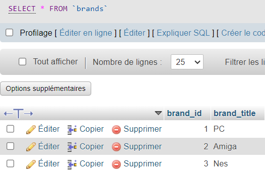

# ECOMMERCE - PROJET DEV B2B

Il s’agit d’un site e-Commerce de vente de jeux vidéo. Les utilisateurs peuvent acheter des jeux vidéo. Un espace administration permet de gérer les jeux en vente et les informations des membres


## Objectifs

- Créer un site web
- créer une base de données et des tables pour stocker les données du site
- créer des requêtes SQL pour manipuler les données de votre base de données

## Techno

PHP, CSS, HTML

XAMPP(phpmyadmin)


## Features

Partie Administrateur:

• authentification <br><br>
• tableau de bord <br>
    o nombre de membres <br>
    o nombre de ventes
<br>
<br>
• les administrateurs peuvent gérer les jeux avec un CRUD <br>

o le CRUD permet d'ajouter/modifier/supprimer un jeu avec :<br>
    ▪ un nom<br>
    ▪ une description<br>
    ▪ une photo<br>
    ▪ une marque<br>
    ▪ un prix<br>
    ▪ une catégorie<br>
    <br>
• les administrateurs peuvent gérer les membres avec un CRUD<br>
o le CRUD permet de modifier :<br>
    ▪ un prénom<br>
    ▪ un nom<br>
    ▪ une adresse email<br>
    ▪ un mot de passe<br>

o les administrateurs peuvent consulter :<br>
    ▪ les achats de jeux

Partie Membres:

• la page d’accueil :<br>
    o liste de tous les jeux disponibles<br>
    o un système de recherche par le nom du jeu<br>

• les utilisateurs peuvent se créer un compte et se connecter.<br>
o chaque profil utilisateur possède :<br>
    ▪ un prénom<br>
    ▪ un nom<br>
    ▪ une adresse email<br>

• la page produit contient<br>
    o l'image du jeu<br>
    o le nom du jeu<br>
    o le prix du jeu<br>
    o un bouton d’achat

## Pages

Le site se composera obligatoirement des pages suivantes :<br>
• page d'accueil (catalogue des jeux vidéo)<br>
• page produit<br>
• page du panier d’achat<br>
• page d’espace membre<br>
• page d’inscription / connexion<br>

L'administration se composera obligatoirement des pages suivantes :<br>
• page tableau de bord<br>
• page des membres<br>
• page des jeux<br>
• page de connexion

## BDD

Voici des captures d'écran des tables de notre bdd (mystore)
1. Côté Membres
- USER TABLE


- USER PAYMENTS


- USER ORDERS


- ORDERS PENDING


2. Côté Administrateur
- ADMIN TABLE


- BRANDS



- CATEGORIES 


- PRODUCTS


## Demo


## Deployment

Pour déployer ce projet :

```bash
  git clone https://github.com/Roockbye/E-Commerce.git
```
Utiliser Laragon ou XAMPP pour telecharger notre base de données ou la recréer (bdd présente dans les fichiers)
Puis accéder au site directement depuis le navigateur : http://localhost/Projet-dev/index.php

## Authors

- LANIC Gaëlle
- MARMANDE Mélanie

